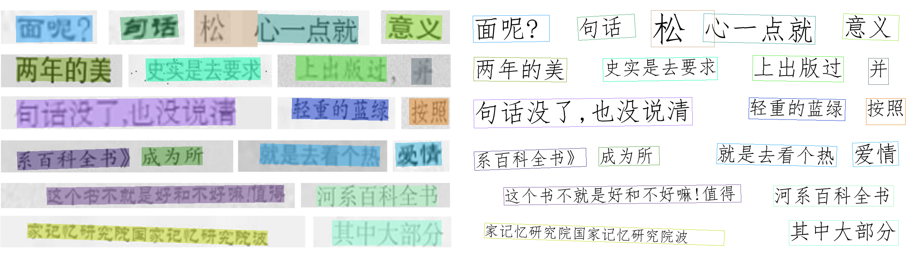

<br>
<h1 align="center">读光 OCR ONNX</h1>
<br>
<p align="center">
<a href="https://github.com/xxx/xxx/blob/master/README_en_US.md">中文</a>  |  <a href="">English</a>
</p>

## ✨简介

本项目旨在提供一个简单易用的读光OCR ONNX 模型解决方案，以便快速上手并集成读光OCR模型到自己的项目中。

[读光OCR](https://modelscope.cn/models/iic/cv_convnextTiny_ocr-recognition-general_damo/summary)是一款功能强大的光学字符识别模型，支持中文、英文识别。采用ONNX格式，我们可以更方便地进行部署和推理。



## 🛠️ 使用

### 环境安装

```python
onnx
onnxruntime
numpy
pyclipper
shapely
opencv-python
pillow
```

> 测试时使用的依赖具体版本可以参考 `requirements.txt` 文件
>
> 目前只测试了cpu环境

### 模型下载

需要下载下面表格中一对文字识别和检测模型。

| 模型  | 模型大小      | 模型原始仓库                                                 | 百度网盘下载                                                 | modelscope下载                                               |
| ----- | ------------- | ------------------------------------------------------------ | ------------------------------------------------------------ | ------------------------------------------------------------ |
| large | 73.2MB+46.4MB | rec[地址](https://modelscope.cn/models/iic/cv_convnextTiny_ocr-recognition-general_damo/summary)，det [地址](https://www.modelscope.cn/models/iic/cv_resnet18_ocr-detection-db-line-level_damo/summary) | [地址](https://pan.baidu.com/s/1BQeeOelYU0N5PJSuf_kG3A?pwd=gztj) | [地址](https://modelscope.cn/models/mscoder/duguang-ocr-onnx/summary) |
| small | 7.4MB+5.2MB   | rec[地址](https://modelscope.cn/models/iic/cv_LightweightEdge_ocr-recognitoin-general_damo/summary)，det [地址](https://www.modelscope.cn/models/iic/cv_proxylessnas_ocr-detection-db-line-level_damo/summary) | [地址](https://pan.baidu.com/s/1kyWRX18-5MRkizyoGz-I7Q?pwd=khkj ) | [地址](https://modelscope.cn/models/mscoder/duguang-ocr-onnx/summary) |

> rec 为文本识别模型，det为文本检测模型

### 使用示例

```python
from dgocr.dgocr import DGOCR

# 文字识别模型路径
rec_path = r"models/large/recognition_model_general"
# 文本框检测模型文件路径
det_path = r"models/large/detection_model_general/model_1600x1600.onnx"
img_size=1600  # 文本框检测模型的输入图片大小限制

# 初始化模型
ocr = DGOCR(rec_path, det_path, img_size)

img_path = "data/test.png"   # 图片案例

# 识别图片
ocr_result = ocr.run(img_path)

# 打印结果
for i in range(len(ocr_result)):
    print(f"第{i}个框")
    print(f"{ocr_result[i]}")

# 可视化
save_path = "data/result.png"
ocr.draw(img_path, ocr_result, save_path)
```

打印结果说明

```
[[[75, 610], [731, 631], [729, 672], [74, 651]], 0.6671288197716327, '家记忆研究院国家记忆研究院波']

三部分分别是
[box, score, text]; box 为文本框四个点坐标, score文本框的置信度 [0-1], text 为识别的文本
```

## 📍测试

20张图片

## 感谢

[读光-文字识别-行识别模型-中英-通用领域](https://modelscope.cn/models/iic/cv_convnextTiny_ocr-recognition-general_damo/summary)

[读光-文字检测-DBNet行检测模型-中英-通用领域](https://www.modelscope.cn/models/iic/cv_resnet18_ocr-detection-db-line-level_damo/summary)

[PaddleOCR](https://github.com/PaddlePaddle/PaddleOCR)

[modelscope](https://github.com/modelscope/modelscope)
